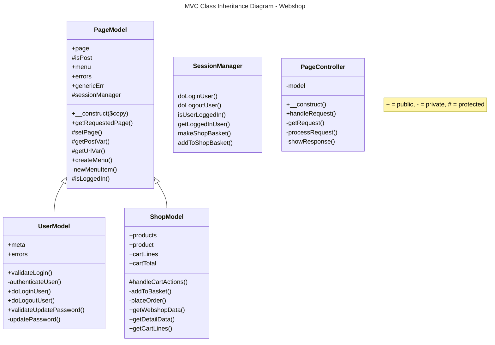

```mermaid
---
title: MVC Class Inheritance Diagram - Webshop
---
classDiagram
    note "+ = public, - = private, # = protected"
    %% A <|-- B means that class B inherits from class A %%
    PageModel <|-- UserModel
    PageModel <|-- ShopModel

    class SessionManager{
        doLoginUser()
        doLogoutUser()
        isUserLoggedIn()
        getLoggedInUser()
        makeShopBasket()
        addToShopBasket()
    }

    class PageController{
      -model
      +__construct()
      +handleRequest()
      -getRequest()
      -processRequest()
      -showResponse()
    }

    class PageModel{
      +page
      #isPost
      +menu
      +errors
      +genericErr
      #sessionManager
      +__construct($copy)
      +getRequestedPage()
      #setPage()
      #getPostVar()
      #getUrlVar()
      +createMenu()
      -newMenuItem()
      #isLoggedIn()
    }

    class UserModel{
    +meta
    +errors
    +validateLogin()
    -authenticateUser()
    +doLoginUser()
    +doLogoutUser()
    +validateUpdatePassword()
    -updatePassword()
    }

    class ShopModel{
    +products
    +product
    +cartLines
    +cartTotal
    #handleCartActions()
    -addToBasket()
    -placeOrder()
    +getWebshopData()
    +getDetailData()
    +getCartLines()
    }


```
