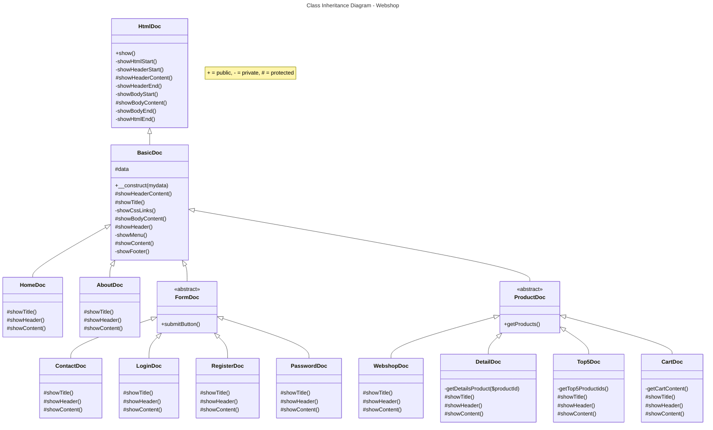

```mermaid
---
title: Class Inheritance Diagram - Webshop
---
classDiagram
    note "+ = public, - = private, # = protected"
    %% A <|-- B means that class B inherits from class A %%
    HtmlDoc <|-- BasicDoc

    BasicDoc <|-- HomeDoc
    BasicDoc <|-- AboutDoc
    BasicDoc <|-- FormDoc
    BasicDoc <|-- ProductDoc

    FormDoc <|-- ContactDoc
    FormDoc <|-- LoginDoc
    FormDoc <|-- RegisterDoc
    FormDoc <|-- PasswordDoc

    ProductDoc <|-- WebshopDoc
    ProductDoc <|-- DetailDoc
    ProductDoc <|-- Top5Doc
    ProductDoc <|-- CartDoc

    class HtmlDoc{
       +show()
       -showHtmlStart()
       -showHeaderStart()
       #showHeaderContent()
       -showHeaderEnd()
       -showBodyStart()
       #showBodyContent()
       -showBodyEnd()
       -showHtmlEnd()
    }
    class BasicDoc{
        #data 
        +__construct(mydata)
        #showHeaderContent()
        #showTitle()
        -showCssLinks()
        #showBodyContent()
        #showHeader()
        -showMenu()
        #showContent()
        -showFooter()
    }
    class HomeDoc{
        #showTitle()
        #showHeader()
        #showContent()
    }
    class AboutDoc{
        #showTitle()
        #showHeader()
        #showContent()
    }
    class FormDoc{
        <<abstract>>
        +submitButton()
    }
    class ContactDoc{
        #showTitle()
        #showHeader()
        #showContent()
    }
    class LoginDoc{
        #showTitle()
        #showHeader()
        #showContent()
    }
    class RegisterDoc{
        #showTitle()
        #showHeader()
        #showContent()
    }
    class PasswordDoc{
        #showTitle()
        #showHeader()
        #showContent()
    }

    class ProductDoc{
        <<abstract>>
        +getProducts()
    }

    class WebshopDoc{
        #showTitle()
        #showHeader()
        #showContent()
    }

    class Top5Doc{
        -getTop5Productids()
        #showTitle()
        #showHeader()
        #showContent()
    }

    class DetailDoc{
        -getDetailsProduct($productId)
        #showTitle()
        #showHeader()
        #showContent()
    }

    class CartDoc{
        -getCartContent()
        #showTitle()
        #showHeader()
        #showContent()
    }


```
